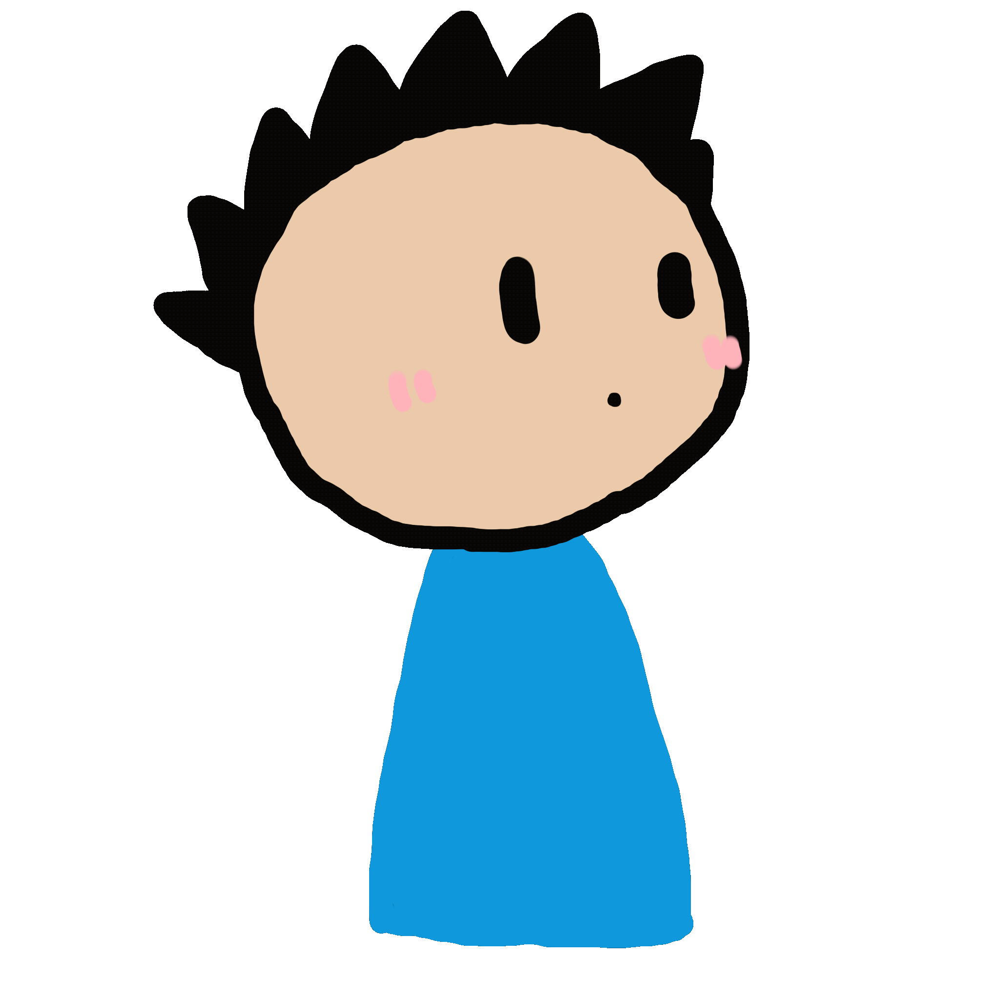

<h2></h2>

<h3>Environment</h3>

  

<h3>Languages &amp; Skills</h3>

          

<h3>Link</h3>

National Institute of Technology Kushiro College Programming Circle's Website.

<li>
<a href="https://nitkpc.com">nitkpc.com</a> is created by me.
</li>

